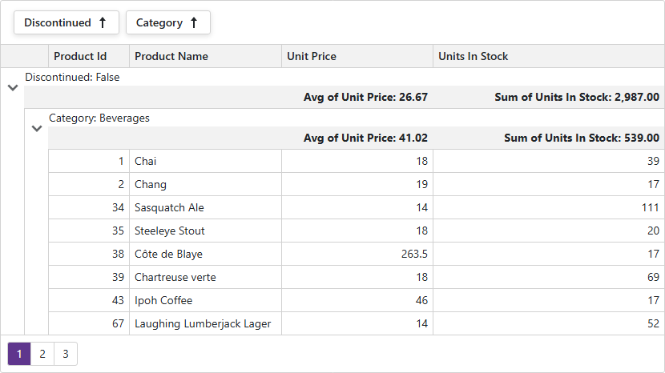

<!-- default badges list -->

<!-- default badges end -->
# Blazor Grid - Customize Group Summaries

The [DevExpress Blazor Grid](https://docs.devexpress.com/Blazor/403143/components/grid) component can calculate [group summary](https://docs.devexpress.com/Blazor/DevExpress.Blazor.DxGrid.GroupSummary) values across all records in a group. You can use the [DataColumnGroupRowTemplate](https://docs.devexpress.com/Blazor/DevExpress.Blazor.DxGrid.DataColumnGroupRowTemplate) property to specify custom content and appearance for summary rows.

## Implementation Details

The [GroupRowContent.razor](CS/GroupSummaries/Components/GroupRowContent.razor) custom Razor component defines a template for both group row content and group summaries aligned with their respective columns. Its internal structure is built with a standard HTML table layout.

This template is included in the DxGrid component through the [DataColumnGroupRowTemplate](https://docs.devexpress.com/Blazor/DevExpress.Blazor.DxGrid.DataColumnGroupRowTemplate) property. The row data is passed through the [Context](https://docs.devexpress.com/Blazor/DevExpress.Blazor.GridDataColumnGroupRowTemplateContext) property to the `GroupRowContent` custom component. The row's context also allows to access the Grid's instance. It is used to render the required column structure within the HTML table element, the group row, and group summary values. Visual styles for these elements are defined in the accompanying [GroupRowContent.razor.css](CS/GroupSummaries/Components/GroupRowContent.razor.css) stylesheet.

The `InitializeSummaryTable` JavaScript function synchronizes the column widths of the template with the grid's columns. It also attaches a [ResizeObserver](https://developer.mozilla.org/en-US/docs/Web/API/ResizeObserver) to the grid, which automatically updates the table's column widths whenever the grid is resized.
JavaScript functions are defined in the [root component](CS/GroupSummaries/Components/App.razor). They are invoked from the page's `OnAfterRender` lifecycle event using Blazor [JS Interop](https://learn.microsoft.com/en-us/aspnet/core/blazor/javascript-interoperability/call-javascript-from-dotnet).

The grid's [LayoutAutoSaving](https://docs.devexpress.com/Blazor/DevExpress.Blazor.DxGrid.LayoutAutoSaving) event is used to handle Grid layout changes. When the event fires, the custom component invokes the `AdjustSummaryTable` JavaScript function to ensure the group row display is updated correctly.

## Files to Review

- [Index.razor](CS/GroupSummaries/Components/Pages/Index.razor)
- [GroupRowContent.razor](CS/GroupSummaries/Components/GroupRowContent.razor)
- [GroupRowContent.razor.css](CS/GroupSummaries/Components/GroupRowContent.razor.css)
- [App.razor](CS/GroupSummaries/Components/App.razor)

## Documentation

- [DxGrid Component](https://docs.devexpress.com/Blazor/DevExpress.Blazor.DxGrid)
- [DxGrid.GroupSummary Property](https://github.com/DevExpress-Examples/blazor-DxGrid-Detail-Information-DxFormLayout)
- [DxGrid.DataColumnGroupRowTemplate Property](https://docs.devexpress.com/Blazor/DevExpress.Blazor.DxGrid.DataColumnGroupRowTemplate)
- [GridDataColumnGroupRowTemplateContext Class](https://docs.devexpress.com/Blazor/DevExpress.Blazor.GridDataColumnGroupRowTemplateContext)
- [DxGrid.LayoutAutoSaving Event](https://docs.devexpress.com/Blazor/DevExpress.Blazor.DxGrid.LayoutAutoSaving)

## More Examples

- [Grid for Blazor - Customize cell appearance based on custom conditions](https://github.com/DevExpress-Examples/blazor-dxgrid-conditional-formatting)
- [Blazor Grid - How to display detail information using DxFormLayout](https://github.com/DevExpress-Examples/blazor-DxGrid-Detail-Information-DxFormLayout)

<!-- feedback -->
## Does this example address your development requirements/objectives?

 

(you will be redirected to DevExpress.com to submit your response)
<!-- feedback end -->
